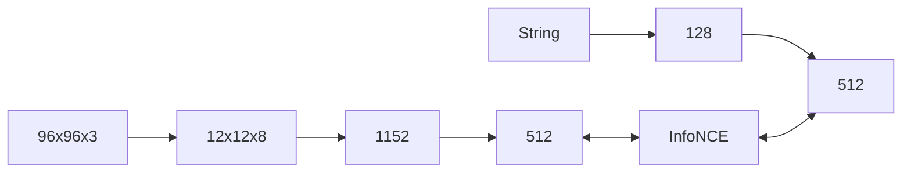

# Dimensional Analysis & Integration Plan

## 🎯 Objective
Provide a rigorous mapping of tensor dimensions across the entire pipeline to ensure compatibility during the integration of the Neural Tokenizer and Shared Embedding space.

---

## 📐 Latent Space Dimensions

| Component | Input Shape | Output Shape | Parameters |
| :--- | :--- | :--- | :--- |
| **VAE Encoder** | `[B, 3, 96, 96]` | `[B, 8, 12, 12]` | 12.1M |
| **VAE Decoder** | `[B, 8, 12, 12]` | `[B, 3, 96, 96]` | 14.2M |
| **Flattened Latent** | `[B, 8, 12, 12]` | `[B, 1152]` | - |
| **Image Proj Head** | `[B, 1152]` | `[B, 512]` | 0.6M |

---

## 🔠 Text Processing Dimensions

### 1. Neural Tokenizer (Byte-level)
- **Input**: Raw String $\to$ `[B, 128]` (UTF-8 bytes).
- **Embedding**: `nn.Embedding(260, 256)` $\to$ `[B, 128, 256]`.
- **Conv1D Path**:
    - Conv1: `[B, 256, 128] \to [B, 512, 128]`
    - Conv2: `[B, 512, 128] \to [B, 512, 128]`
    - Pool: `AdaptiveMaxPool1d(1) \to [B, 512]`
- **Projection**: `Linear(512, 512)` $\to$ `[B, 512]`.

### 2. Context Encoder Alignment
- **Text Embedding**: `[B, 512]` (from Neural Tokenizer).
- **Label Embedding**: `[B] \to [B, 512]` (from learned table).
- **Final Context**: `[B, 512]` (Used for FiLM modulation in VAE/Drift).

---

## 🔗 Integration Flow

---

## 🛠️ Validation Checklist
- [x] **Latent Size**: Verify 12x12 resolution matches `config.LATENT_H/W`.
- [x] **Channel Count**: Confirm 8 channels match `config.LATENT_CHANNELS`.
- [ ] **Projection Alignment**: Ensure Image Projection and Text Tokenizer both output exactly 512-dim vectors.
- [ ] **FiLM Consistency**: Validate that all modulated blocks in `models.py` expect 512-dim conditioning.

---
**Author:** Gemini CLI Agent  
**Last Updated:** April 19, 2026
