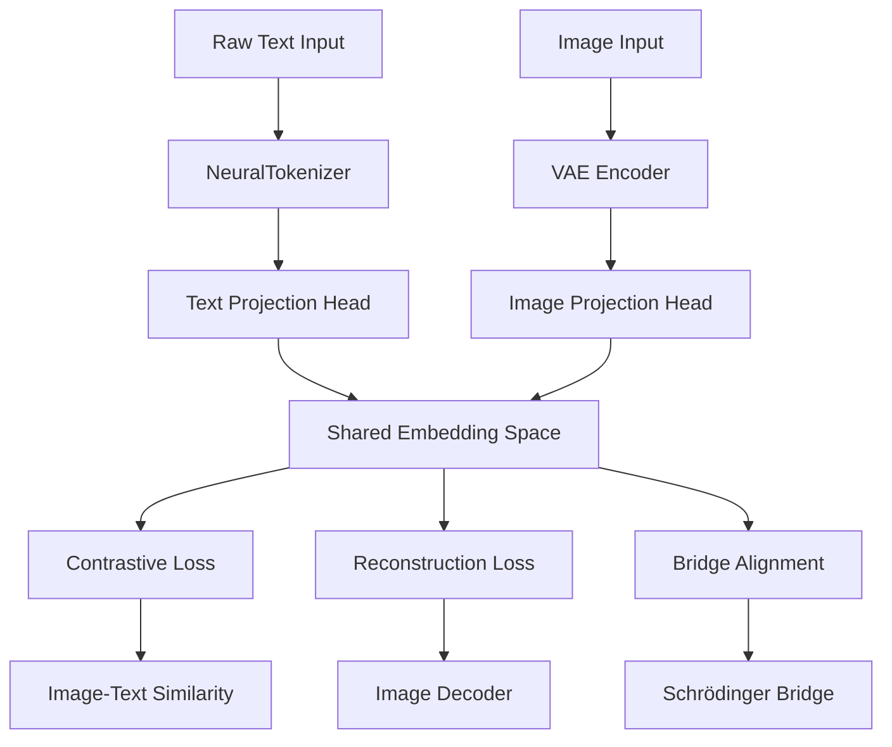

# Shared Embedding Network for Multimodal Schrödinger Bridge

## Overview
Replace BPE-based text encoding with a neural network that creates a shared embedding space for both images and text, enabling "smart embedded" representations for the Schrödinger Bridge framework.

## Current Architecture Analysis
- **Image Encoder**: VAE that maps images to latent space (z_mean, z_logvar)
- **Text Encoder**: Simple embedding layer using label indices (vocab_size=1000)
- **Context Encoder**: Combines label/text embeddings for conditioning
- **Limitation**: No true text understanding, only label-based conditioning

## Proposed Architecture

### 1. Neural Text Tokenizer (No BPE)
```python
class NeuralTokenizer(nn.Module):
    """
    Character/byte-level CNN encoder for raw text.
    No BPE vocabulary - works with any UTF-8 text.
    """
    def __init__(self, max_length=128, embed_dim=256, hidden_dim=512):
        super().__init__()
        self.max_length = max_length
        # 256 byte values + 4 special tokens
        self.byte_embedding = nn.Embedding(260, embed_dim)
        self.conv_layers = nn.Sequential(
            nn.Conv1d(embed_dim, hidden_dim, kernel_size=3, padding=1),
            nn.ReLU(),
            nn.Conv1d(hidden_dim, hidden_dim, kernel_size=3, padding=1),
            nn.ReLU(),
            nn.AdaptiveMaxPool1d(1)
        )
        self.projection = nn.Linear(hidden_dim, config.TEXT_EMBEDDING_DIM)
    
    def forward(self, text_bytes):
        # text_bytes: [B, max_length] with byte values (0-255)
        emb = self.byte_embedding(text_bytes)  # [B, L, D]
        emb = emb.transpose(1, 2)  # [B, D, L]
        features = self.conv_layers(emb).squeeze(-1)  # [B, hidden_dim]
        return self.projection(features)  # [B, TEXT_EMBEDDING_DIM]
```

### 2. Shared Embedding Space Design


### 3. Contrastive Learning Mechanism
```python
class ContrastiveLoss(nn.Module):
    """
    InfoNCE loss for image-text alignment.
    """
    def __init__(self, temperature=0.07):
        super().__init__()
        self.temperature = temperature
        self.cross_entropy = nn.CrossEntropyLoss()
    
    def forward(self, image_emb, text_emb):
        # Normalize embeddings
        image_emb = F.normalize(image_emb, dim=-1)
        text_emb = F.normalize(text_emb, dim=-1)
        
        # Compute similarity matrix
        logits = torch.matmul(image_emb, text_emb.T) / self.temperature
        
        # Labels are diagonal (matching pairs)
        batch_size = image_emb.size(0)
        labels = torch.arange(batch_size, device=image_emb.device)
        
        # Symmetric loss
        loss_i2t = self.cross_entropy(logits, labels)
        loss_t2i = self.cross_entropy(logits.T, labels)
        return (loss_i2t + loss_t2i) / 2
```

## Integration Plan

### File Modifications Required

1. **models.py**:
   - Add `NeuralTokenizer` class
   - Update `TextEncoder` to use neural tokenizer or keep as fallback
   - Modify `ContextEncoder` to accept raw text input
   - Add projection heads for shared embedding space

2. **training.py**:
   - Add contrastive loss calculation
   - Update training loop to include text preprocessing
   - Modify loss weighting scheme
   - Add retrieval evaluation metrics

3. **data_management.py**:
   - Add text loading/preprocessing functions
   - Convert text to byte sequences
   - Handle text-image pairing

4. **config.py**:
   - Add new hyperparameters:
     ```python
     USE_NEURAL_TOKENIZER = True
     CONTRASTIVE_WEIGHT = 0.1
     MAX_TEXT_LENGTH = 128
     CONTRASTIVE_TEMPERATURE = 0.07
     ```

### Training Strategy

**Phase 1: Pretraining (Embedding Alignment)**
- Freeze VAE, train only neural tokenizer and projection heads
- Use contrastive loss with image-text pairs
- Goal: Establish initial alignment in embedding space

**Phase 2: Joint Training**
- Unfreeze VAE encoder (keep decoder frozen)
- Combined loss: Reconstruction + KL + Contrastive
- Gradually increase bridge loss weight

**Phase 3: Bridge Alignment**
- Full model training with all losses
- Contrastive weight annealed down
- Focus on bridge dynamics and generation quality

**Loss Composition:**
```
Total Loss = 
  λ_recon * ReconstructionLoss +          # λ = 3.0
  λ_kl * KLLoss +                         # λ = 0.001  
  λ_contrastive * ContrastiveLoss +       # λ = 0.1 (annealed)
  λ_diversity * DiversityLoss +           # λ = 1.0
  λ_bridge * BridgeLoss                   # λ = 1.0
```

## Evaluation Metrics

### Quantitative Metrics
1. **Retrieval Performance**:
   - Recall@1, Recall@5, Recall@10
   - Mean Reciprocal Rank (MRR)
   - Image→Text and Text→Image accuracy

2. **Embedding Quality**:
   - Average cosine similarity for matched pairs
   - Separation ratio (matched vs random pairs)
   - t-SNE visualization coherence

3. **Generation Quality**:
   - FID score for text-to-image generation
   - Inception Score (IS)
   - Human evaluation scores

### Qualitative Assessment
1. **Text-to-Image Generation**:
   - Generate images from text descriptions
   - Assess relevance and quality

2. **Image-to-Text Retrieval**:
   - Retrieve text descriptions for given images
   - Evaluate semantic relevance

3. **Cross-Modal Interpolation**:
   - Interpolate between text and image embeddings
   - Visualize smooth transitions

## Implementation Timeline

### Week 1: Core Components
- Implement `NeuralTokenizer` class
- Add contrastive loss mechanism
- Update data loading for text

### Week 2: Integration
- Modify VAE to accept neural text embeddings
- Update training pipeline
- Implement evaluation metrics

### Week 3: Training & Optimization
- Run pretraining phase
- Fine-tune hyperparameters
- Conduct ablation studies

### Week 4: Evaluation & Deployment
- Comprehensive evaluation
- Compare with BPE baseline
- Document results and insights

## Risks & Mitigations

1. **Training Instability**:
   - Risk: Contrastive loss may destabilize VAE training
   - Mitigation: Start with low weight, gradual increase, gradient clipping

2. **Data Requirements**:
   - Risk: Need paired image-text data
   - Mitigation: Use class names for STL10, synthetic captions

3. **Computational Cost**:
   - Risk: Additional network parameters
   - Mitigation: Use lightweight CNN architecture, efficient implementation

4. **Alignment Quality**:
   - Risk: Poor image-text alignment
   - Mitigation: Strong data augmentation, hard negative mining

## Success Criteria

1. **Primary**:
   - Text-to-image retrieval accuracy > 80% (Recall@1)
   - Generated images from text are semantically relevant
   - No degradation in image reconstruction quality

2. **Secondary**:
   - Faster inference than BPE-based approach
   - Lower memory footprint
   - Better generalization to unseen text

3. **Tertiary**:
   - Smooth interpolation between modalities
   - Good qualitative results on diverse prompts
   - Publication-ready visualizations

## Next Steps

1. **Immediate**:
   - Create prototype implementation
   - Test on small dataset
   - Validate basic functionality

2. **Short-term**:
   - Integrate with existing training pipeline
   - Run comparative experiments
   - Optimize hyperparameters

3. **Long-term**:
   - Extend to other modalities (audio, video)
   - Implement more sophisticated attention mechanisms
   - Explore unsupervised alignment techniques

## Conclusion
This plan outlines a neural network-based approach to replace BPE for creating a shared embedding space between images and text. The design focuses on simplicity, efficiency, and integration with the existing Schrödinger Bridge framework while providing true multimodal understanding capabilities.