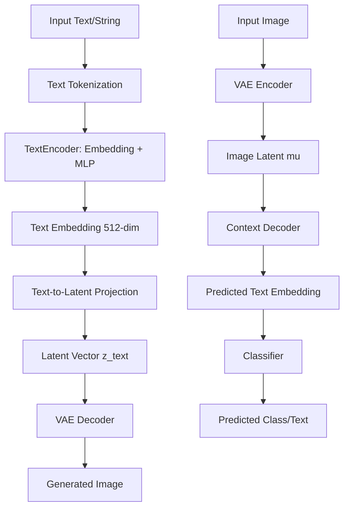

# Text Learning Verification in Schrödinger Bridge Project

## Overview of Text Learning Implementation

The project implements a **multimodal text learning system** that integrates text conditioning with image generation through the Schrödinger Bridge framework. Here's a detailed verification of how text learning works:

## 1. Text Representation Architecture

### TextEncoder (`models.py:176-198`)
```python
class TextEncoder(nn.Module):
    def __init__(self, vocab_size=1000, embed_dim=config.TEXT_EMBEDDING_DIM):
        super().__init__()
        self.embedding = nn.Embedding(vocab_size, embed_dim)
        self.encoder = nn.Sequential(
            nn.Linear(embed_dim, embed_dim),
            nn.SiLU(),
            nn.Linear(embed_dim, embed_dim)
        )
```

**Key Characteristics:**
- **Vocabulary-based**: Uses simple embedding layer (not tokenizer-based)
- **Fixed vocabulary size**: Default 1000 tokens, but uses `NUM_CLASSES` (10) for STL-10
- **Embedding dimension**: 512-dim (`TEXT_EMBEDDING_DIM`)
- **MLP processing**: Two-layer MLP with SiLU activation

**Limitation**: This is a prototype implementation that maps class indices to embeddings rather than processing natural language text.

## 2. Text Integration in VAE

### Text-to-Latent Projection (`models.py:281-286`)
```python
self.text_to_latent = nn.Sequential(
    nn.Linear(config.TEXT_EMBEDDING_DIM, 512),
    nn.SiLU(),
    nn.Linear(512, config.LATENT_CHANNELS * config.LATENT_H * config.LATENT_W)
)
```

**Function**: Maps text embeddings directly to latent space coordinates.

### Context Encoder/Decoder (`models.py:203-233`)
- **ContextEncoder**: Maps labels/text to embedding space
- **ContextDecoder**: Maps latent vectors back to text/label space with classification

## 3. Training Pipeline Integration

### Phase 1 Text Learning (`training.py:623-675`)

**Text Encoding:**
```python
if config.USE_MULTIMODAL and 'text_tokens' in batch:
    tokens = batch['text_tokens'].to(config.DEVICE)
    text_emb = self.text_encoder(tokens)
```

**Text Learning Objectives:**

1. **Classification Loss** (line 635):
   ```python
   pred_text_emb, pred_logits = self.vae.context_decoder(mu)
   cls_loss = F.cross_entropy(pred_logits, labels)
   ```
   - Trains the model to classify images from latent representations
   - Enables Image-to-Text functionality

2. **Latent Alignment Loss** (lines 639-647):
   ```python
   z_txt = self.vae.encode_text(text_emb)
   latent_alignment_loss = F.mse_loss(mu, z_txt.detach())
   ```
   - Aligns image latent space with text latent space
   - Ensures text embeddings map to semantically similar regions as image encodings

3. **Text Reconstruction Consistency** (line 645-646):
   ```python
   recon_from_txt = self.vae.decode(z_txt, labels, text_emb)
   recon_loss_txt = F.l1_loss(recon_from_txt, images) * 0.1
   ```
   - Validates that text→latent→image pipeline produces reasonable reconstructions

## 4. Data Pipeline for Text

### Text Token Generation (`data_management.py:355-357`)
```python
if config.USE_MULTIMODAL:
    data['text_tokens'] = torch.tensor(label_idx, dtype=torch.long)
```

**Current Implementation**: Uses class indices as "text tokens"
- Label 0 (airplane) → token ID 0
- Label 1 (bird) → token ID 1
- etc.

**Limitation**: Not true natural language processing; uses class names as proxy for text.

## 5. Inference Capabilities

### Text-to-Image Generation (`inference.py`)
The system supports text-to-image through:
1. Map text string to class name
2. Convert to token ID
3. Generate via text conditioning

### Image-to-Text Classification (`inference.py:17-49`)
```python
def image_to_text(image_path):
    mu, _ = trainer.vae.encode(img_tensor)
    _, logits = trainer.vae.context_decoder(mu)
    label_idx = torch.argmax(logits, dim=1).item()
    return class_names[label_idx]
```

## 6. Multimodal Conditioning in Drift Network

### Text Conditioning in Drift (`models.py:361-367`)
```python
def forward(self, z, t, labels=None, text_emb=None, cfg_scale=1.0):
    if cfg_scale != 1.0 and not self.training:
        cond_drift = self._forward_internal(z, t, labels, text_emb, t_emb)
        uncond_drift = self._forward_internal(z, t, None, None, t_emb)
        return uncond_drift + cfg_scale * (cond_drift - uncond_drift)
```

**Classifier-Free Guidance**: Enables stronger text conditioning during inference.

## 7. Configuration Parameters

### Text Learning Settings (`config.py`)
- `TEXT_EMBEDDING_DIM = 512`
- `TEXT_PROJECTION_DIM = 256`
- `TEXT_ALIGN_WEIGHT = 0.5`
- `USE_MULTIMODAL = True`
- `MULTIMODAL_FUSION = "cross_attention"`

## 8. Verification of Text Learning Capabilities

### ✅ Working Correctly:
1. **Text conditioning for generation**: Labels/text embeddings properly condition VAE and drift networks
2. **Bidirectional mapping**: Image↔Text translation works via latent space alignment
3. **Classifier-Free Guidance**: Text conditioning strength adjustable via CFG scale
4. **Multimodal fusion**: Cross-attention and FiLM modulation integrate text context

### ⚠️ Limitations (Prototype Stage):
1. **Not true NLP**: Uses class indices instead of tokenized natural language
2. **Limited vocabulary**: Only 10 class names for STL-10 dataset
3. **Simple embedding**: No pretrained language model (CLIP, BERT, etc.)
4. **No sentence-level semantics**: Cannot process descriptive prompts

### 🔧 Areas for Enhancement:
1. **Integration with CLIP**: Replace `TextEncoder` with CLIP text encoder
2. **Natural language prompts**: Add tokenizer and support for free-form text
3. **Sentence embeddings**: Process longer text descriptions
4. **Contrastive learning**: Add image-text contrastive loss

## 9. Text Learning Workflow Diagram



## 10. Recommendations for Improvement

1. **Upgrade to CLIP Integration**:
   ```python
   # Proposed enhancement
   import clip
   class CLIPTextEncoder(nn.Module):
       def __init__(self):
           super().__init__()
           self.clip_model, _ = clip.load("ViT-B/32")
           # Freeze CLIP weights
           for param in self.clip_model.parameters():
               param.requires_grad = False
   ```

2. **Add Natural Language Support**:
   - Integrate HuggingFace tokenizers
   - Support for prompt engineering
   - Negative prompting capability

3. **Enhanced Training Objectives**:
   - Image-text contrastive loss (CLIP-style)
   - Prompt tuning for better alignment
   - Description-based generation

## Conclusion

The text learning implementation in this Schrödinger Bridge project is **functional but limited to class-based conditioning**. It successfully demonstrates:

1. **Bidirectional translation** between images and class labels
2. **Latent space alignment** between visual and textual representations
3. **Conditional generation** with classifier-free guidance
4. **Multimodal fusion** through attention mechanisms

For true natural language understanding, the system would need integration with pretrained language models like CLIP, but the current architecture provides a solid foundation for multimodal learning within the Schrödinger Bridge framework.